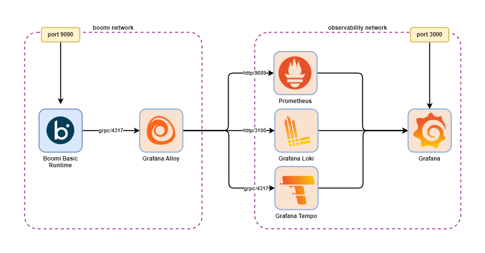

# Boomi OpenTelemetry Grafana Observability Stack



## Overview
This repository provides a Docker Compose-based observability stack for a Boomi runtimes, including:
- **Prometheus** for metrics collection
- **Loki** for log aggregation
- **Tempo** for distributed tracing
- **Grafana** for visualization and dashboards
- **Alloy** for OpenTelemetry pipeline and data forwarding

This repository should be used as a reference demo and not production ready. 

## Directory Structure

- `docker-compose.yml` — Compose file for Boomi runtime, Alloy, Grafana, Prometheus, Loki, Tempo, Consul
- `prometheus/` — Prometheus configuration files
- `loki/` — Loki configuration files
- `tempo/` — Tempo configuration files
- `alloy/` — Alloy configuration files
- `grafana/` — Grafana data and provisioning
- `postman/` — Postman collection to enable OTel on a Boomi runtime

## Quick Start

1. Clone the repository:
	```sh
	git clone https://github.com/adambedenbaugh/boomi-opentelemetry-grafana.git
	cd boomi-opentelemetry-grafana
	# Ensure correct permissions for container
	sudo chmod -R 775 ./
	sudo chmod -r 777 ./alloy
	sudo chown -R 1000:1000 ./
	```
2. Edit the `.env` file with your values. 
3. Ensure that Docker and Docker Compose are installed. Full instructions can be found here: [Docker Doc: Install Docker Engine](https://docs.docker.com/engine/install/)
	Run `adduser` to add your current user to the docker group. 
	```sh
	sudo usermod -aG docker $USER
	```
	Next, log out of the ssh session and back in.
4. Start the observability stack:
	```sh
	docker compose up -d
	```
5. Enable OpenTelemetry on the Boomi runtime using Postman. The attached [Postman collection](postman/Boomi_RuntimeObservabilitySettings.postman_collection.json) contains the required API call. Before executing the request, update the following in the collection's Auth and Variables section:
	- Set the username and password under Auth.
	- Set `atomId` under Variables.
	- Set `accountId` under Variables to include the Boomi Account Id. 
6. Restart Boomi runtime within Boomi's Platform UI. 
7. Access Grafana at `http://<host>:3000` (default user: admin / admin)
8. In Grafana, navigate to Connections -> Data source -> Add new data source. If the following sources are not found, then click Connections -> Add new connction. Add the following data sources and URLs:
    - loki: URL http://loki:3100
    - prometheus: URL http://prometheus:9090
    - tempo: URL http://tempo:3200

## Configuration

- **Docker**: Edit `.env` for Boomi and Alloy Docker environment variables.
- **Prometheus**: Edit `prometheus/prometheus.yml` to add scrape targets. By default, Prometheus uses port 9090, but in this setup, port 9000 is used to avoid a conflict with Boomi’s web service, which also defaults to 9090.
- **Loki**: Edit `loki/loki.yml` for log ingestion settings.
- **Tempo**: Edit `tempo/tempo.yml` for trace storage and endpoints.
- **Alloy**: Edit `alloy/alloy.yml` for OpenTelemetry pipeline and exporters.

## Troubleshooting

- Ensure all containers are running and not restarting on a loop.
- Check container logs with `docker logs <container_name>` for errors.

## Useful Links

- [Boomi DockerHub](https://hub.docker.com/r/boomi/atom/)
- [Grafana Documentation](https://grafana.com/docs/)
- [Prometheus Documentation](https://prometheus.io/docs/)
- [Loki Documentation](https://grafana.com/docs/loki/latest/)
- [Tempo Documentation](https://grafana.com/docs/tempo/latest/)
- [OpenTelemetry](https://opentelemetry.io/)

---
Feel free to contribute or open issues for improvements!
